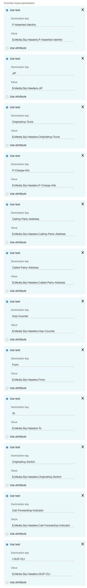

# Next Caller VeriCall API for Amazon Connect

Cloudformation template and Python script to invoke Next Caller's VeriCall API via an Amazon Lambda function.

## Credentials

If you'd like to use the Next Caller VeriCall API please reach out to us at [https://nextcaller.com](https://nextcaller.com) to obtain credentials.

## Official API Documentation

Documentation for the Next Caller VeriCall API can be found at: [https://docs.nextcaller.com/vericall](https://docs.nextcaller.com/vericall/index.html)

## Usage

You'll need the following information:

* VeriCall Username
* VeriCall Password
* Amazon Connect Instance ID

### AWS Permissions

The CloudFormation template that is deployed via either option below will require the following IAM permissions:

* AWS::Connect::ContactFlowModule
* AWS::IAM::Role
* AWS::Lambda::Function
* AWS::Logs::LogGroup

Additionally, you will need permissions to create a CloudFormation stack when using CloudFormation.

#### AWS::Connect::ContactFlowModule
This will create a Contact Flow Module such that it can be dropped into any existing Amazon Connect ContactFlow for ease of use. The Contact Flow Module invokes the VeriCall Lambda function with the required parameters and stores the risk score and pin score as Contact Attributes.

#### AWS::IAM::Role
This creates the IAM role that will be used by the Lambda function. The IAM role is using the 3 AWS managed policies:
* AWSXrayWriteOnlyAccess
* AWSLambdaExecute
* AWSLambdaBasicExecutionRole

#### AWS::Lambda::Function
This is the main AWS Lambda function that invokes the VeriCall API.

#### AWS::Logs::LogGroup
This creates a CloudWatch Log Group to collect log information for the Lambda function. This is an optional resource as without it the Lambda function will automatically create a LogGroup at first invocation.

### Option 1 (GUI):

1. Upload `template.yaml` in your CloudFormation console and follow the prompts.
2. Enable the AWS Lambda function in your Amazon Connect instance (Amazon Connect Instance --> Contact Flows --> AWS Lambda)

### Option 2 (CLI):

Use `sam` to build, invoke and deploy the function.

1. Download and setup SAM: https://docs.aws.amazon.com/serverless-application-model/latest/developerguide/serverless-sam-cli-install.html
2. Use `sam build` to build the application: 
`sam build -b build -t aws/cloudformation/stack.yaml`
3. In your Amazon account create an S3 bucket to upload the code to (you can use an existing one you have read/write access to).
4. Use `sam deploy` to deploy the application (remember to replace the `REPLACE_ME` with your information specific information): 
```
sam deploy -t build/template.yaml --s3-bucket REPLACE_ME1 \
  --stack-name REPLACE_ME2  \
  --parameter-overrides \
    ParameterKey=ConnectInstanceId,ParameterValue=REPLACE_ME3 \
    ParameterKey=APIUsername,ParameterValue=REPLACE_ME4 \
    ParameterKey=APIPassword,ParameterValue=REPLACE_ME5 \
  --capabilities CAPABILITY_IAM
```
5. Enable the AWS Lambda function in your Amazon Connect instance (Amazon Connect Instance --> Contact Flows --> AWS Lambda)

## Connect Integration
If you didn't use the CloudFormation template from earlier you'll need to update your Lambda Integration in your Amazon Connect Contact Flow to store a few attributes as input parameters when invoking the function:


